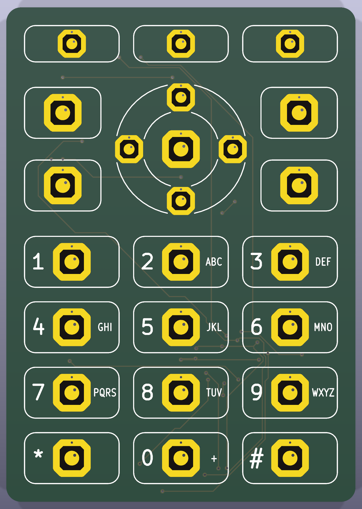
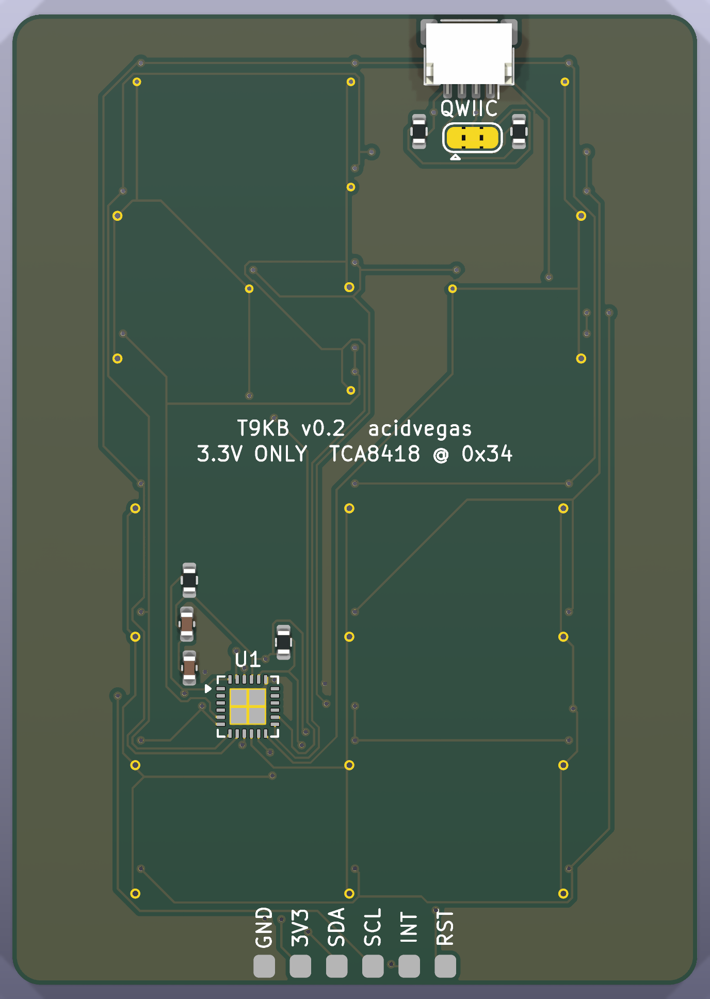
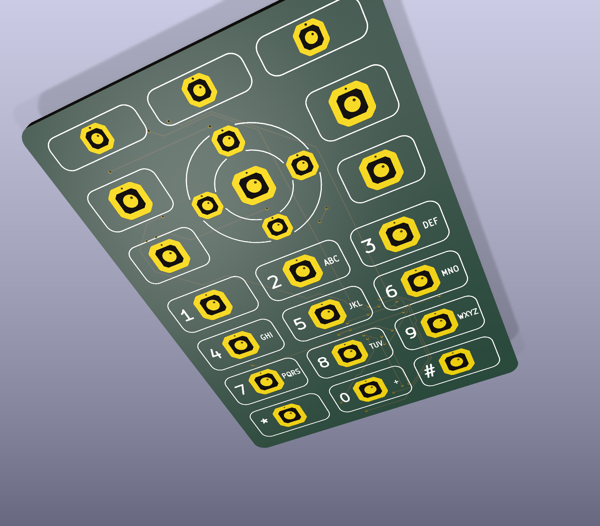
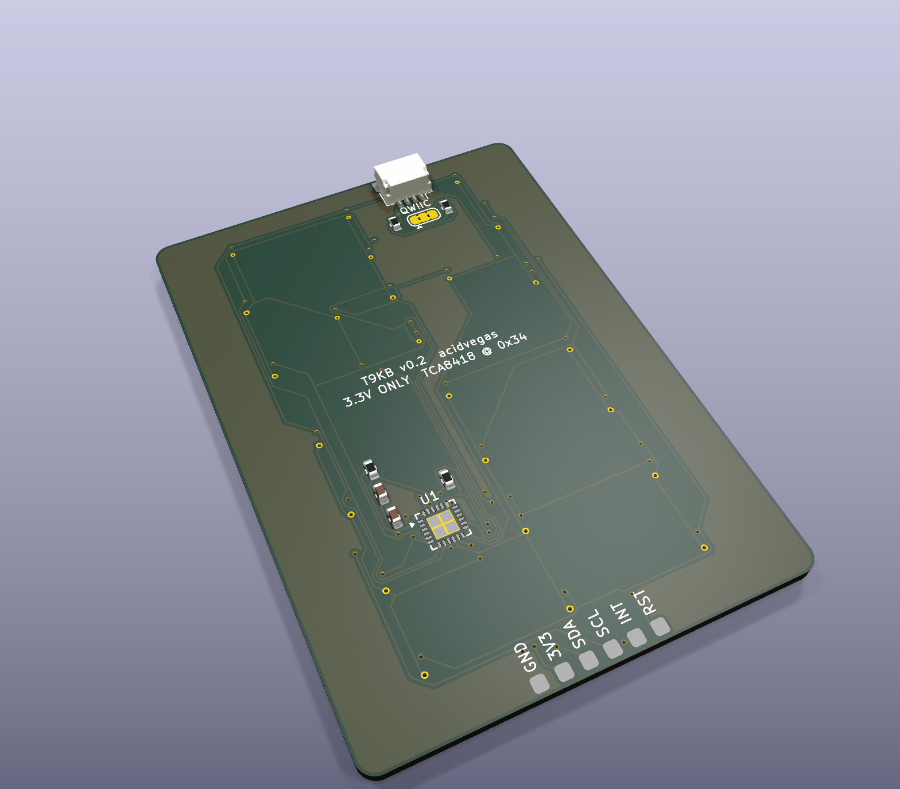

# T9KB

A tiny phone-style keypad for DIY projects that talks I2C. Plug it into an ESP32 *(or anything with Qwiic / I2C)* and you get the full key layout of an old desk phone handset: 3 soft keys, a 5-way d-pad, call / end / speaker / mute, and the 3x4 number pad.

There are virtually no good small modules on the market for basic I2C text input. The [M5Stack CardKB](https://docs.m5stack.com/en/unit/cardkb_1.1) is about the only one, and it is a tiny QWERTY board. Nothing like it exists for T9, so I made this one for T9 phone-style input on my own projects, starting with a DIY VoIP phone.

The layout follows the Grandstream WP826 handset. Keys are metal snap domes on gold pads, the same way real phones do it, and a 3D printed TPU key mat goes on top. A single TI TCA8418 scans the keys, so the board has no firmware to flash. The text side *(multi-tap, T9, key repeat)* lives in an Arduino library on the host.

**Status:** v0.2 hardware is designed and ready to order, not built or tested yet. The Arduino library is not written yet.

<p align="center">
  
  &nbsp;
  
</p>
<p align="center">
  
  &nbsp;
  
</p>

The 3D model for case and key mat design is `hardware/t9kb.step`.

## Arduino library

Planned in `library/` of this repo, written for the ESP32 Arduino core. It will handle everything the keypad chip does not:

- Named key events *(press, release, long press)* plus CardKB-style `getChar()` codes, so code written for the CardKB is easy to port
- Multi-tap text entry with a configurable timeout *(800 ms default)* and modes abc, Abc, ABC and 123
- Long press: a digit key types the digit, `#` changes mode, `0` types `+`
- Right soft key is backspace, with auto-repeat on backspace and the arrows
- A raw event API for anyone who wants the key numbers directly
- T9 word prediction later

It will work over the Qwiic cable alone *(polling)*, or with the INT pin wired for instant, interrupt-driven reads.

## Specs

| Item        | Value                                                                               |
| ----------- | ----------------------------------------------------------------------------------- |
| Board size  | 48 x 68 mm, 1.6 mm thick, 2 layers, 2 mm corner radius                              |
| Keys        | 24 metal dome pads *(Snaptron patterns: 17 for 5 / 5.3 mm domes, 7 for 4 mm domes)* |
| Controller  | TI TCA8418 keypad scanner, no firmware                                              |
| I2C address | 0x34 *(fixed)*                                                                      |
| Power       | 3.3 V only *(1.65 to 3.6 V)*                                                        |
| Connector   | Qwiic / STEMMA QT *(JST SH 4-pin)*, top edge, parts side                            |
| Key face    | Flat: gold dome pads and legends only *(KiCad bottom layer)*                        |
| Parts side  | All parts *(8 total, KiCad top layer)*                                              |

## Key layout

All sizes in mm, measured on the key face. The key area is 43 x 63, centered on the board with a 2.5 border on every side.

| Keys         | Count | Size                          | Dome |
| ------------ | ----- | ----------------------------- | ---- |
| Soft keys    | 3     | 13 x 5                        | 4 mm |
| D-pad ring   |       | 18 circle                     |      |
| D-pad center | 1     | 10.5 circle                   | 5 mm |
| D-pad arrows | 4     | In the ring around the center | 4 mm |
| Side keys    | 4     | 10.5 x 7, two on each side    | 5 mm |
| Number keys  | 12    | 13 x 7                        | 5 mm |

| Gap                                    | Size |
| -------------------------------------- | ---- |
| Between soft keys, between number keys | 2    |
| Soft keys to d-pad                     | 3    |
| Soft keys to side keys                 | 3.5  |
| Between the 2 stacked side keys        | 3    |
| D-pad to number keys                   | 3    |
| Side keys to number keys               | 3.5  |

The outer edges of the soft keys, side keys and number keys all line up.

## Connections

Qwiic connector *(J1)*:

| Pin | Signal |
| --- | ------ |
| 1   | GND    |
| 2   | 3.3V   |
| 3   | SDA    |
| 4   | SCL    |

Breakout pads on the bottom edge of the parts side *(J2, 2.54 mm pitch, solder wires or an SMD header)*:

| Pad | Signal | Notes                                                         |
| --- | ------ | ------------------------------------------------------------- |
| 1   | GND    |                                                               |
| 2   | 3V3    |                                                               |
| 3   | SDA    |                                                               |
| 4   | SCL    |                                                               |
| 5   | INT    | Goes low when a key event is waiting *(10k pull-up on board)* |
| 6   | RST    | Pull low to reset the TCA8418 *(10k pull-up on board)*        |

Qwiic has no spare wire for INT. Over Qwiic alone the host polls the keypad; solder a wire from J2's INT pad to a GPIO for interrupt-driven reads and wake-on-keypress.

The board has 4.7k I2C pull-ups through the 3-pad solder jumper JP1. It comes bridged. If you chain it with other boards that already have pull-ups, cut both copper bars on JP1.

## Key map

The TCA8418 reports a key number from 1 to 80 *(`row * 10 + column + 1`)*. Bit 7 of the event byte is 1 for press, 0 for release.

| Key         | Row | Col | Key number |
| ----------- | --- | --- | ---------- |
| 1           | 0   | 0   | 1          |
| 2           | 0   | 1   | 2          |
| 3           | 0   | 2   | 3          |
| Soft left   | 0   | 3   | 4          |
| Soft middle | 0   | 4   | 5          |
| Soft right  | 0   | 5   | 6          |
| 4           | 1   | 0   | 11         |
| 5           | 1   | 1   | 12         |
| 6           | 1   | 2   | 13         |
| Speaker     | 1   | 3   | 14         |
| Up          | 1   | 4   | 15         |
| Mute        | 1   | 5   | 16         |
| 7           | 2   | 0   | 21         |
| 8           | 2   | 1   | 22         |
| 9           | 2   | 2   | 23         |
| Left        | 2   | 3   | 24         |
| OK          | 2   | 4   | 25         |
| Right       | 2   | 5   | 26         |
| *           | 3   | 0   | 31         |
| 0           | 3   | 1   | 32         |
| #           | 3   | 2   | 33         |
| Call        | 3   | 3   | 34         |
| Down        | 3   | 4   | 35         |
| End         | 3   | 5   | 36         |

Minimum setup over I2C:

| Register | Name     | Write | Why                               |
| -------- | -------- | ----- | --------------------------------- |
| 0x1D     | KP_GPIO1 | 0x0F  | Rows 0 to 3 are keypad rows       |
| 0x1E     | KP_GPIO2 | 0x3F  | Columns 0 to 5 are keypad columns |
| 0x01     | CFG      | 0x01  | Interrupt on key events           |

Then read `KEY_LCK_EC` *(0x03)* for the event count, read `KEY_EVENT_A` *(0x04)* once per event, and write 0x01 to `INT_STAT` *(0x02)* to clear the interrupt.

The board has no diodes, so single keys and 2-key combos are reliable. Pressing 3 keys that form an L in the matrix can show a fake 4th key.

## Parts

Assembled by JLCPCB *(all on the parts side)*:

| Ref    | Part                        | Package         | LCSC    | JLC type |
| ------ | --------------------------- | --------------- | ------- | -------- |
| U1     | TCA8418RTWR                 | WQFN-24 4x4 mm  | C138713 | Extended |
| J1     | JST SM04B-SRSS-TB *(Qwiic)* | SMD right angle | C160404 | Extended |
| C1     | 100 nF                      | 0603            | C14663  | Basic    |
| C2     | 10 uF                       | 0603            | C19702  | Basic    |
| R1, R2 | 4.7k *(I2C pull-ups)*       | 0603            | C23162  | Basic    |
| R3, R4 | 10k *(RST, INT pull-ups)*   | 0603            | C25804  | Basic    |

Bought separately and added by hand:

| Qty | Part                                         | Where    | Notes                      |
| --- | -------------------------------------------- | -------- | -------------------------- |
| 20  | 5 to 5.3 mm metal domes *(see Dome sources)* | Varies   | 17 needed, rest are spares |
| 10  | 4 mm metal domes *(see Dome sources)*        | Varies   | 7 needed, rest are spares  |
| 1   | Kapton *(polyimide)* tape                    | Anywhere | Only for loose domes       |

## Dome sources

The pads follow Snaptron's published single-sided contact patterns: 17 pads for 5 / 5.3 mm domes and 7 pads for 4 mm domes *(soft keys and d-pad arrows)*. Prices and stock were checked on 2026-10-07.

Recommended, exact match for the pad patterns with a known force:

| Pads | Part                                 | Source                                                                                          | Force       | Price          | Notes             |
| ---- | ------------------------------------ | ----------------------------------------------------------------------------------------------- | ----------- | -------------- | ----------------- |
| 5 mm | Snaptron GX05170 *(5.3 mm four-leg)* | [DigiKey 4955-GX05170-ND](https://www.digikey.com/en/products/detail/snaptron/GX05170/20376517) | 170 g ±30 g | $36.37 for 100 | Loose, needs tape |
| 4 mm | Snaptron GX04200 *(4.0 mm four-leg)* | [DigiKey 4955-GX04200-ND](https://www.digikey.com/en/products/detail/snaptron/GX04200/20376515) | 200 g ±30 g | $37.99 for 100 | Loose, needs tape |
| Tape | 1" polyimide *(Kapton style)* tape   | [Amazon B006ZFNB2I](https://www.amazon.com/Mil-Kapton-Tape-Polyimide-yds/dp/B006ZFNB2I)         |             |                |                   |

Cheaper, peel-and-stick, from [ButtonWorx](https://buttonworx.com) *(Maine, US, $4 minimum order, no force listed)*:

| Pads | Part                                                                                                                    | Price      | Fit                                                                    |
| ---- | ----------------------------------------------------------------------------------------------------------------------- | ---------- | ---------------------------------------------------------------------- |
| 5 mm | [Snap Dome Round 5mm Dimple, Peel and Stick option](https://buttonworx.com/metal-domes/285-snap-dome-round-5mmD.html)   | $0.80 each | Whole rim on the frame                                                 |
| 5 mm | [Snap Dome Chopped Circle 5.2mm Peel & Stick](https://buttonworx.com/metal-domes/291-snap-dome-cut-circle-5-2x3-8.html) | $0.50 each | Fits                                                                   |
| 4 mm | [Snap Dome Round 4mm Dimple, Peel and Stick option](https://buttonworx.com/metal-domes/284-snap-dome-round-4mmD.html)   | $0.80 each | Marginal: rim rests on the frame corners only, no size tolerance given |

The adhesive squares around neighboring d-pad domes may overlap; trim them if they do. A 4.5 mm dome does not fit the 4 mm pads.

## Ordering from JLCPCB

Upload `hardware/fab/t9kb_gerbers.zip` and use these settings:

| Setting        | Value                                               |
| -------------- | --------------------------------------------------- |
| Layers         | 2                                                   |
| Dimensions     | 48 x 68 mm *(auto-detected)*                        |
| Material       | FR-4                                                |
| PCB thickness  | 1.6 mm *(Economic PCBA only offers ENIG at 1.6 mm)* |
| Surface finish | ENIG *(required, the dome contacts need gold)*      |
| Gold thickness | 2U" *(1U" also works)*                              |
| PCB assembly   | Yes, Economic                                       |
| Assembly side  | Top side                                            |
| BOM / CPL      | `hardware/fab/BOM.csv` and `hardware/fab/CPL.csv`   |

On the placement preview page, check these before paying:

- **U1:** the dot on the chip lines up with the pin 1 triangle printed on the board.
- **J1:** the connector opening faces the top edge of the board.

If either is turned wrong, rotate it right there in the preview. Resistors and capacitors do not care.

## Assembly

1. Clean the key face with isopropyl alcohol.
2. Place a dome on each gold pad, centered on the round contact *(not on the small hole, which is off-center on purpose)*. The small pads *(soft keys and d-pad arrows)* take 4 mm domes, the rest take 5 mm domes. Four-leg domes go with a leg on each of the 4 cut corners of the gold frame.
3. Tape over the domes with Kapton tape, or use peel-and-stick domes. Air vents through the small hole in each center pad, so the tape can cover the domes fully.
4. Test by pressing each dome with a finger while reading key events.

A dome that sits crooked can be peeled off and placed again. Nothing on the key face is soldered.

## Rebuilding the board

The board is generated by script *(KiCad 9)*. There is no schematic; the netlist lives in `gen_pcb.py`.

```
cd hardware
./autoroute.sh    # place parts, autoroute with freerouting, pour ground, run DRC
python3 fab.py    # gerbers, drill files, BOM, CPL
```

`autoroute.sh` expects `freerouting.jar` in `tools/`. Download it from the [freerouting v2.0.1 release](https://github.com/freerouting/freerouting/releases/tag/v2.0.1) *(needs Java 21)*.

## References

- `ref/tca8418.pdf`: [TI TCA8418 datasheet](https://www.ti.com/lit/ds/symlink/tca8418.pdf)
- `ref/snaptron_guide.pdf`: Snaptron metal dome design guide *(contact pad patterns, plating, venting)*

## Notes

- The TCA8418 exposed pad is tied to ground, as TI recommends *(ground or floating, never power)*.
- Dome pads follow Snaptron's single-sided contact patterns for 5 / 5.3 mm and 4 mm domes, with the off-center via-in-pad option for 2-layer boards. There is no solder mask inside the pad area, per Snaptron.
- U1 uses TI's own land pattern and stencil for the RTW0024B package *(TCA8418 datasheet)*.
- The key face is the KiCad bottom layer so JLC assembles the top side.
- LEDs and backlight were removed for this revision. They may come back later.
